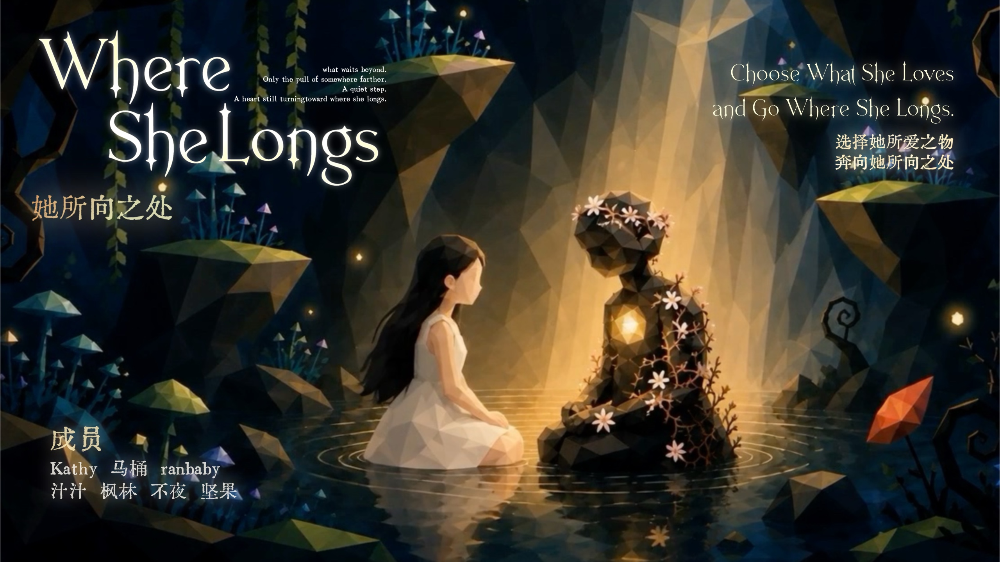
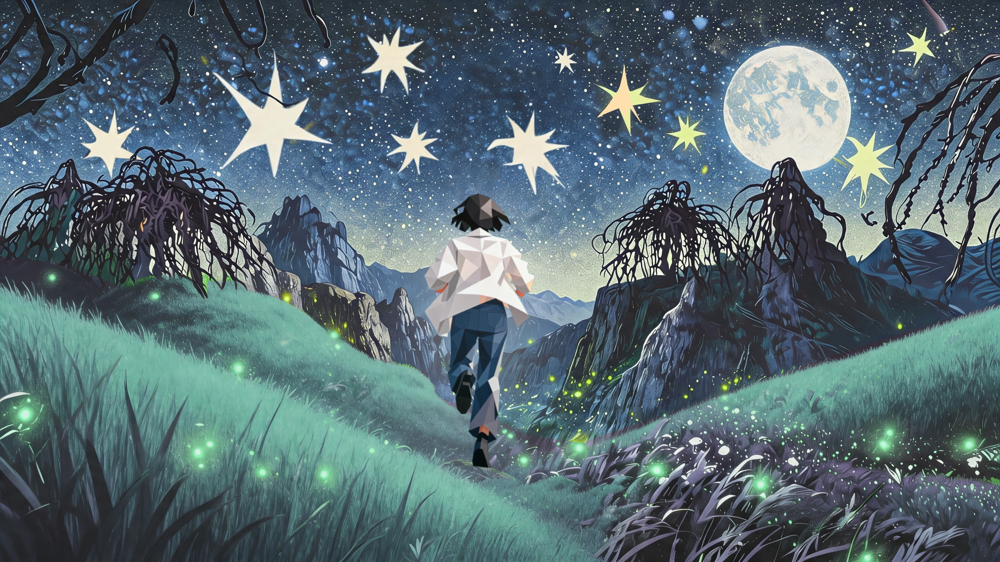
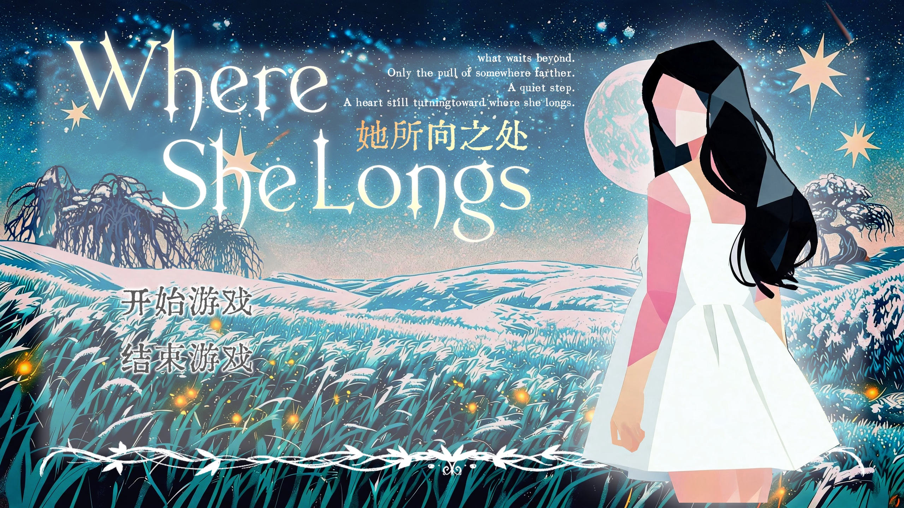
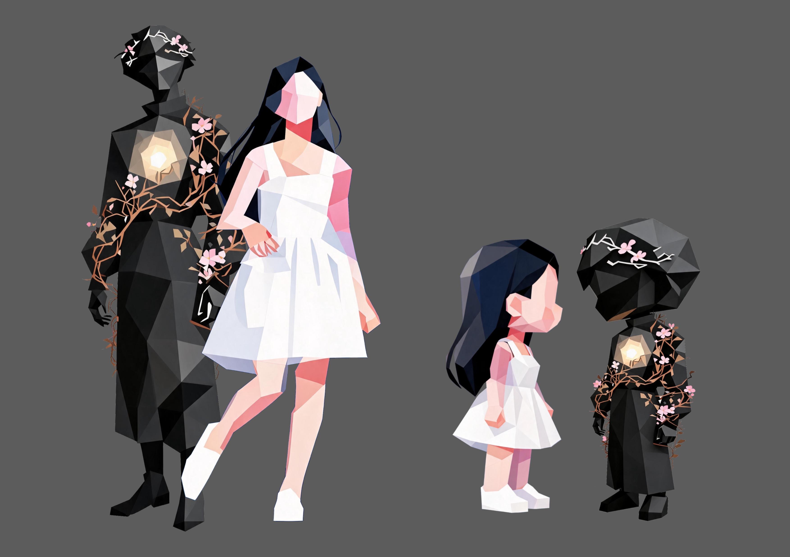
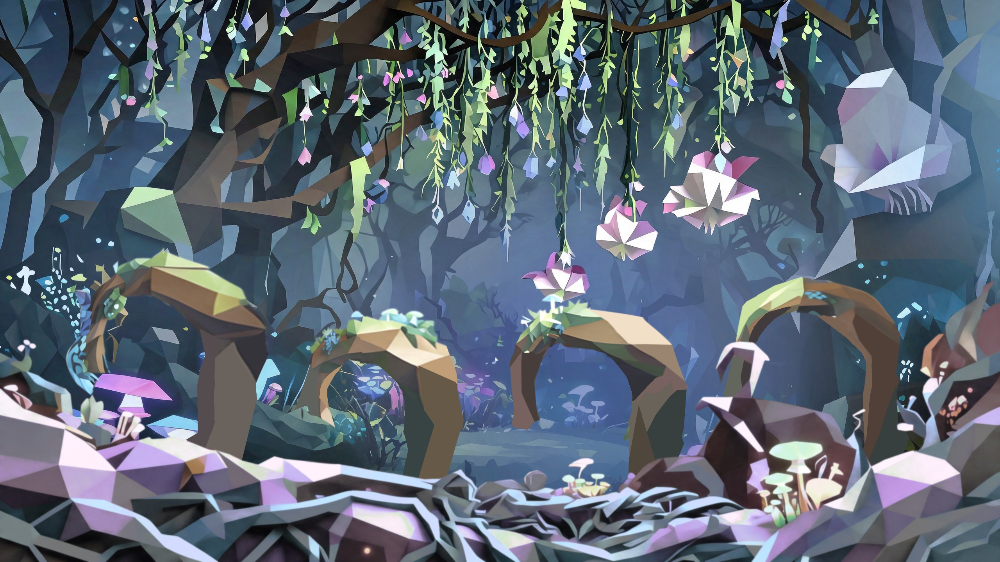
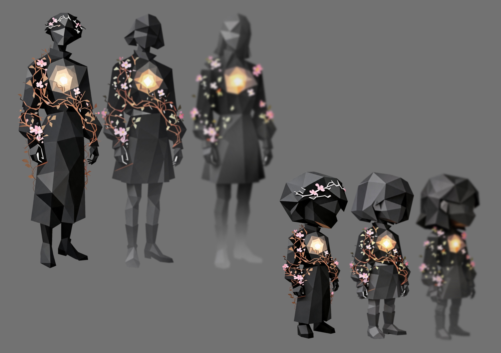

# 游戏说明 

**团队名称：** 老公你说句话啊婚姻咨询所

**作品名称：**《她所向之处》\| Where She Longs

**游戏类型：** 游戏类型：叙事驱动冒险互动游戏

<!-- IMG-04 草原 · 奇妙夜 -->

  

<!-- IMG-01 主视觉 / 封面 -->

  

<!-- IMG-02 标题画面 -->

  

## 1. 作品名称

**《她所向之处》**

**英文名：Where She Longs**

**名称出处：**

灵感来源于古希腊诗人萨福（Sappho）的残诗：

"I say it's whatever you love best."

"而我说，最美的是你自己所爱之物。"

——Sappho, Fragment 16

"she could not remember anything but longing"

"她什么也无法记起，除了心中的渴望。"

——Sappho, Fragment 16

"I don't know where I go / my mind is two minds"

"我不知道自己将往何处 / 我的心分作两心。"

——Sappho, Fragment 51

"I desire / And I crave."

"我渴望 / 我欲求。"

——Sappho, Fragment 36

她所向之处，便是她要去的地方。

## 2. 作品 Slogan

> **「选择她所爱之物，奔向她所向之处。**
>
> **Choose what she loves and go where she longs.」**

<!-- IMG-03 海报 1 -->

  

## 3. 作品描述

选择三十岁之前结婚。

选择一份稳定的工作。

选择一个人人觉得"合适"的对象。

选择固定利率的房贷、体面的婚礼、完美的婚纱照。

选择养生、低卡饮食、定期体检。

选择在饭局上被问"你什么时候结婚"时微笑。

选择在会议上咽下异议。

选择在自己的野心面前，假装没那么想要。

选择在朋友圈发"做自己"，然后删掉。

选择不在公共场合哭。

选择不在公共场合生气。

选择不在公共场合做任何"太激烈"的事。

选择在喜欢的人面前装作不太喜欢。

选择在被伤害之后说"我没事"。

选择和妈妈冷战。

选择在心里说"我不想变成你"，同时又怕自己正在变成你。

选择做一个好女儿。

选择做一个好女友。

选择做一个"好相处的人"。

选择做一个从不让别人为难的人。

选择在某一天突然意识到——

你已经很久很久，没有听过自己身体里那个声音了。

但在这个奇妙夜里，你可以先不选。

穿越黑暗森林，在天亮之前，

先看见自己。

这一次，你的选择奔向所向之处。

29岁的小凌，明天就要结婚了。

未婚夫思雨什么都好：工作稳定，性情温良。婚礼流程完美得像一份执行清单。小凌问"如果明天不结呢"？只得到一句"你婚前焦虑了。"

结婚前夜，母亲对她说："你马上三十岁了"。小凌闭上了眼睛，坠入了一个奇妙夜：

月光低垂的无垠草原上，她遇见一个短发女孩，两个人追着发光的小动物奔跑；森林边缘，她被一个心脏发光的神秘男孩阿麦吸引，**主动闭上眼走进黑暗**——睁眼时，她第一次从第三人称视角看见了自己，一个模糊的、不完整的自己。她跟着阿麦穿越森林、跳过黑湖的石头，在湖面倒影里发现：那个越来越模糊的男孩，轮廓越来越像她自己。她沉入水中。

救起她的是那个短发女孩。湖边，两个处在不同人生阶段、却怀着同样困惑的女人彻夜长谈。女孩伸出手——无名指上的银戒指、掌纹、一道小疤痕——小凌认出了她：那是年轻时的妈妈。

天亮了，婚礼进行曲响起。

**她要走向哪里？**

《她所向之处》\| Where She Longs是一款叙事驱动的互动剧情游戏。它以"看与被看"为视觉母题：当一个人不了解自己时，目光全部向外，投射在他人和世界身上；唯有看见自己，目光才能既望向世界，也照见内心。游戏用第一人称与第三人称视角的切换、闭眼倾听的交互、以及奇妙夜中草原、黑暗森林、黑湖的奇幻相遇，让玩家在一场婚礼前夜的内心冒险中，看见自己身体里的渴望。

原来"婚礼"要去找的"老公"，是她自己。这是她选择自己所爱，奔向她所向之处的故事。

## 5. 游戏玩法说明

### 游戏类型

叙事驱动的互动剧情游戏（Narrative Adventure）。以第一人称/第三人称视角切换为核心视觉语言，融合环境探索、对话选择、轻量动作小游戏与主观交互。

**预计游戏时长：** 主线流程约20分钟。

### 故事流程与玩法

#### 第一章 · 新婚彩排（现实世界 · 第一人称）

玩家以盖着头纱的第一人称视角站在婚礼彩排现场。

• **Checklist互动**：点击场景各处，逐项完成婚礼清单（确认站位/音乐/来宾名单/菜单/誓词/婚戒/时间），每完成一项打一个勾。

• **关系叙事**：未婚夫思雨迟到、把誓词推到"明天现场来"、中途因工作离场。玩家在点击与对话中，亲手把一场"完美婚礼"的流程确认完毕——也亲手确认了自己的格格不入。

• 车内对话中，玩家可以说出那句"如果明天不结呢？"

#### 第二章 · 结婚前夜（现实世界 · 第一人称）

• **物品探索**：点击房间中的物品阅读记忆文本——游戏机（"后来大部分时间都是他一个人在玩"）、从未拆封的攀岩鞋、看电影时他睡着的电影票。每件物品都是一段关系的旁证。

• **世界震动**：母亲的催促（"你马上三十岁了""这个年纪的人不能总是什么都不知道"）让世界三次震动、声音失真、声场收窄——玩家在主观听觉的崩塌中坠入梦境。

#### 第三章 · 奇妙夜（内心世界 · 视角切换的核心章节）

**① 草原 · 相遇（自由探索）**

• 小凌在发光草原醒来，遇见一个不知姓名的短发女孩。

• 环境互动：追发光小动物、看草坡顶端游过云层的发光巨鲸、女孩送她一朵靠近就闭合的花。

• 这一段没有任务、没有清单、没有正确路线——是全游戏唯一"没人催她去哪"的空间。

**② 黑暗森林 · 闭眼进入（交互语义：闭眼 = 倾听内心）**

• 森林入口，女孩劝她别去。玩家选择进入后，**主动闭眼**：外部声音一层层消失，只剩呼吸、心跳和很远的虫鸣。

• 睁眼瞬间，**视角从第一人称切换为2D横版第三人称——玩家第一次"看见自己"**。此刻小凌的形象边缘发虚、色彩只有三四成、像没画完，象征她尚未看清自己。

<!-- IMG-05 小凌与阿麦 角色 CG -->

  

**③ 森林冒险 · 阿麦（第三人称 · 轻动作）**

• 心脏发光的神秘男孩阿麦在黑暗中带路，萤火虫排成光轨指路。

• **森林跑酷小游戏**（神庙逃亡式）：跳跃/滑铲躲避藤蔓障碍；跑到中段出现多条路线，**阿麦会模仿玩家的选择**——玩家跳，他也跳。

<!-- IMG-06 黑暗森林 -->

  

• **核心视觉机制**：随着冒险推进，小凌的形象越来越清晰完整，阿麦却越来越模糊，轮廓越来越像小凌。

<!-- IMG-07 阿麦形态渐变 -->

  

**④ 神秘湖 · 跳石头（回到第一人称）**

• 视角切回第一人称，玩家亲自踩上过湖的石头。

• 湖面具有反光：玩家寻找落脚点时，同时看见自己的影子和阿麦的影子——**两个影子从姿态相似逐渐变得无法区分**。阿麦不是别人，是小凌自身欲望与冒险冲动的人格化投射。

• 小凌沉入水中：声音闷下去、心跳变慢、寂静。

**⑤ 湖边 · 对谈（剧情对话 + 主观交互）**

• 短发女孩救起小凌。两个处在不同人生阶段、却拥有相同困惑的女人彻夜长谈。

• 女孩不追问、不评判，只说"因为我也这样"。玩家在对话选项中替小凌做出回应——那些现实里没说出口的话，在湖边第一次说出来。

• **主观交互一·玻璃罐**：闭眼进入主观世界，玩家试图把星星点点的"选择"放进玻璃罐，却怎么也放不进去——具象化"不知道自己要什么"。

• **主观交互二·生活音墙**：做饭点火、打字、洗漱、孩子哭喊、汽笛……各种生活音效从各自分开到逐渐交织、越来越密，玩家用一个手势全部静音——只剩自己的呼吸。

• **手部细节交互**：小凌抓起女孩的手，查看三个细节点位：无名指的银戒指、掌纹皱纹、一道小疤痕——**她是年轻时的母亲**。两个女性在跨代际的凝视中真正照见彼此。

• 世界再次震动，两只手松开的瞬间，梦结束。

#### 第四章 · 典礼上的选择（现实 · 第一人称）

• 婚礼当天，小凌在走廊叫住思雨，说出全部的"不知道"。

• **最终三选一结局**：

> ◦ **A. 走进婚礼**：她与思雨立下新的约定（"以后我想做别的事，你不要告诉我这是不成熟"），自己掀开头纱走向红毯——是她主动选择进入关系。
>
> ◦ **B. 取消婚礼**：她脱下高跟鞋，赤脚跑出酒店，跑进阳光里。
>
> ◦ **C. 暂缓婚礼**："不知道，也可以是一个答案。"婚礼与她的个人主题音乐短暂共存，悬而未决。

• **三个结局不做好/坏/真结局判定**：三种选择都通向她所向之处。

### 核心设计亮点

1\. "**看与被看"的视角语言**：看不见自己（第一人称）→ 闭眼倾听 → 看见自己（第三人称）→ 在倒影中认出欲望就是自己。视角变化即自我认知的变化，玩法与主题完全同构。

2\. "**闭眼"统一交互语义**：闭眼是进入内心世界的开关，贯穿森林入口、玻璃罐、生活音墙等所有主观段落。

3\. **阿麦的视觉渐变**：欲望化身随主角自我清晰而模糊、最终与主角重合——他是女孩内心欲望的投射。

4\. **对话即共感**：神秘女孩不提供答案、不做人生导师，只反复说出"我也这样"——两个女人的彼此照见本身就是力量；对话选择推进叙事，玩家替小凌说出心声。

5\. **母女跨代际凝视**：神秘女孩的真实身份是年轻时的母亲，两个女性在湖边完成的是代际之间的互相照见。

6\. **无标准答案的结局**：游戏不替玩家选择，只让玩家逐步看清楚自己心之所向，做出真正属于自己的选择。

## 6. 项目文档（项目背景、目标用户、技术栈、创新点、团队分工、开发过程、后续计划）

### 6.1 项目背景

作品名取自古希腊诗人萨福残诗Fragment16："she could not remember anything but longing."（"她什么也无法记起，除了心中的渴望。"）萨福是有记载的西方文学史上第一位以第一人称书写爱与渴望的女性声音——两千多年前她写下的"我渴望，我欲求"，正是婚礼前夜的小凌第一次试图辨认的东西。

我们想做一个关于"选择"的游戏。故事设定在一个被所有人定义的"好日子"前夜：黄道吉日、婚礼流程、宾客名单，所有人都告诉29岁的小凌"明天是好日子"，可她问"如果明天不结呢"。游戏不评判走进婚礼、取消婚礼、暂缓婚礼任何一个结局的好坏——因为无论怎么选，那一天都应该是她自己选的日子。自由不是不结婚，而是选择自己所向之处。

七个企业命题在我们的作品里是同一件事的七个侧面：萨福的"渴望本能"、秒哒的"超级个体"、LiberLive 的谁定义"好日子"、eazo 的为说不自己的选择的女孩而做、Zeroth 的"桥接内心世界"、影石的"视界始于她想"、Tripo 的"女性凝视"——都指向同一个内核：**先看见自己，再选择所向之处。**

### 6.2 目标用户

• **核心用户**：身处"奥德赛时期"的年轻人——二十多岁到三十出头，工作没定型、感情没定型、人生方向模糊，被社会期待催着往前走的人。

• **特别为她们而做**：在生活中做不出自己的选择的女孩——选择三十岁之前结婚，选择一份稳定的工作，选择一个人人觉得"合适"的对象，选择固定利率的房贷、体面的婚礼、完美的婚纱照。选择养生、低卡饮食、定期体检，选择在饭局上被问"你什么时候结婚"时微笑，选择在会议上咽下异议，选择在自己的野心面前，假装没那么想要。选择在朋友圈发"做自己"，然后删掉。选择不在公共场合哭，选择不在公共场合生气，选择不在公共场合做任何"太激烈"的事，选择在喜欢的人面前装作不太喜欢，选择在被伤害之后说"我没事"，选择和妈妈冷战，选择在心里说"我不想变成你"，同时又怕自己正在变成你，选择做一个好女儿，选择做一个好女友，选择做一个"好相处的人"，选择做一个从不让别人为难的人……这一次，她要选择她所向之处。

• **场景延伸**：对叙事向独立游戏、女性题材内容、情绪价值体验感兴趣的泛玩家群体；黑客松/游戏展现场的过路体验者（单局体验时长设计为15-20分钟，适配展会场景）。

### 6.3 技术栈与 AI 使用说明

**开发方式：全员 VibeCoding，7 人 × AI 编程 Agent 并行开发。**

• **编程**：团队 7 人每人在本机安装 AI 编程 Agent，按统一《任务单》模板领取任务、并行开发、逐条对照验收标准回传成果。写文案的成员做场景配置，做交互的成员调跑酷小游戏，美术产出可接入资产——一个人加上 AI 就是一条产线。技术统筹负责任务单拆分、模块接口约定与合并验收，主程序兜底核心交互。

• **美术**：场景与角色资产大量借助 AI 图像生成工具快速产出，由美术岗主导风格判断、构图筛选与关键场景人工二次调整；最终审美决策由人完成。

• **剧本**：100%人工原创编排。**游戏内角色对话全部为人工剧本。**

• 游戏技术栈：godot。

核心交互模块包括：第一/第三人称视角切换、闭眼状态的音频分层与输入交互、跑酷/跳石头小游戏、对话选择分支、多结局流程管理。

• **AI 使用合规**：赛前由技术统筹核实各工具商用授权条款；AI 仅用于开发环节（编程辅助 + 美术资产生成），不用于游戏内实时内容生成。

### 6.4 创新点

1\. **视角语言即叙事语言**：第一人称下主角始终看不见自己；主动闭眼、再睁眼切换为第三人称，她才第一次"看见自己"——一个模糊的、不完整的自己。视角变化与自我认知完全同构，"看见自己"不是台词讲出来的，是玩家亲手切视角时意识到的。

2\. "**闭眼"作为统一身体交互**：闭眼是进入内心世界的开关——外部声音一层层消失，只剩呼吸与心跳，玩家由此进入草原、黑暗森林、神秘黑湖。玩法机制刻意调动身体感官：走入黑暗森林时眼前一片漆黑，玩家必须"闭上"眼睛，才能感知自己的身心所向。

3\. **流动的欲望化身"阿麦"**：阿麦是主角内心欲望的投射，性别模糊、外型流动、不被定义——主角看不清自己时阿麦是模糊的，随冒险深入他的形象不断流动变化，逐渐长出长发、穿上裙子，最终在黑湖倒影中与主角轮廓重合。

4\. **跨代际的女性互相照见**：湖对面救起主角的神秘女孩，通过无名指银戒指、掌纹皱纹、一道小疤痕三个交互点位，让玩家自己认出她是年轻时的母亲。她不提供答案、不做人生导师，只是说"我也这样"——两代女性的彼此照见本身就是力量。

5\. **不评判的三结局**：走进婚礼、取消婚礼、暂缓婚礼都没有好坏判定。游戏不替玩家选择，只让选择是她自己做出的。

6\. **技术团队的"超级个体"协作范式**：7人小队在96小时内全员使用AI编程工具并行开发，文案、交互、美术岗都直接产出可运行内容——本作品的开发过程本身就是"AI 唤醒本能"的一次实践，与作品主题互为印证。

### 6.5 团队分工（老公你说句话啊队·7人）

| **角色** | **成员** | **职责** |
| --- | --- | --- |
| 总策划 | 坚果 | 作品开发总控、玩法机制与体验节奏把关、项目技术统筹与进度把控 |
| 文案 | 然比 | 剧本撰写、游戏内文案与叙事设计 |
| 产品PM｜运营 | 枫林 | 项目管理、市场营销与传播、摆摊布展与物料制作 |
| 技术统筹 | 小芷 | 任务单拆分、AI编程协作流程、模块合并验收、授权合规 |
| 交互设计 | Kathy | 闭眼交互、视角切换、对话分支等核心体验设计与实现 |
| 美术 | 不夜 | AI美术资产生成、风格定调、人工筛选与精修 |
| 程序 | 马桶哥 | 主程序兜底、核心玩法实现、Demo演示操作 |

### 6.6 后续计划

1\. **短期（赛后1个月）**：根据现场试玩反馈打磨完整版——补全支线对话、优化闭眼段音频体验、增加结局后"她的所向之处"尾声段落；上线Web试玩版与itch.io页面。

2\. **中期（3-6个月）**：参加 indiePlay、NAVID 等叙事向独立游戏展映；推出移动端版本；基于"奇妙夜"世界观开发DLC章节。

3\. **长期**：做成一个系列——**每个故事，都是一个女孩第一次听见自己的声音。**《她所向之处》是第一部：婚礼前夜。后续故事可以发生在辞职前夜、分手前夜、三十岁前夜……同一个内心世界，不同的"好日子"。

